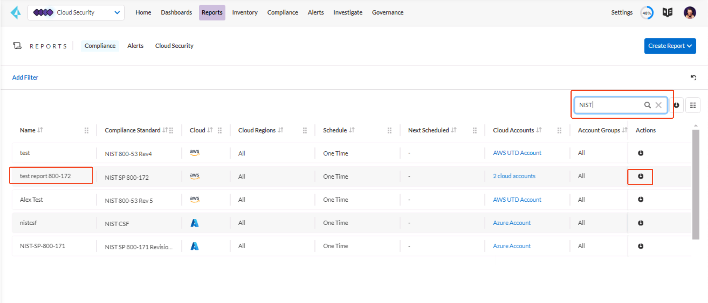

# Prisma Cloud Ultimate Test Drive (UTD) Workshop
## Assignment 1.1
### Prisma Cloud Overview
Prisma Cloud is a comprehensive cloud-native application protection platform (CNAPP) with the industry’s broadest security and compliance coverage. It protects cloud native applications, data, network, compute, storage, users, and higher-level PaaS services across cloud platforms. Prisma Cloud enables capabilities such as Cloud Security Posture Management (CSPM) and Cloud Workload Protection Platform (CWPP) for comprehensive visibility and threat detection across your organization’s hybrid, multi-cloud infrastructure. It dynamically discovers resources as they are deployed and correlates cloud-service-provided data to enable security and compliance insights into your cloud applications and workloads.

In this activity, you will:
* Log in to Prisma Cloud Lab account
* Learn about the Prisma Cloud console and help center
* Review how to on-board a AWS account on Prisma Cloud tenant
* Review out of the box policies, queries, compliance standards and remediations

Note: This is a standalone activity and is not dependent on other activities.

#### Log in to Prisma Cloud Enterprise Edition Console
1. Click on the Prisma Cloud Enterprise tab to open the demo tenant login.

    

2. Follow the screen to login and then click on the Prisma Cloud icon.
    
    *Note: If you see a page expired message then refresh the web page by clicking on the Home button as highlighted in below screen capture.*
3. While using the Prisma Cloud console, you can use CloudShare > Keyboard > Home | Back | Forward to navigate back and forth.

    

4. To check the on-boarded public cloud accounts click on the Settings on the and select Account Groups. Click on the 4 Cloud Account(s) under Default Account Group. You can see the public cloud accounts connected to this Prisma Cloud demo account.
Note: The screenshots captured in this workshop guide might vary slightly from the actual lab account.

    
    

    We have already connected AWS, Azure and GCP accounts to this Prisma Cloud tenant, and this lab account can be used for testing across all three public cloud providers. Prisma Cloud also supports Alibaba Cloud & Oracle Cloud Infrastructure.
    
    *Note: The Prisma Cloud Enterprise Edition account used in this lab is a read-only account, it does not have full access to the Prisma Cloud Service and access to some functions is denied. This account cannot make changes to the configuration of the associated Prisma Cloud Services.*

#### Looking into Prisma Cloud Governance & Policy
In Prisma Cloud, a policy is a set of one or more constraints or conditions that must be adhered to. Prisma Cloud provides predefined policies for configurations and access controls that adhere to established security best practices such as PCI, GDPR, ISO 27001:2013,and NIST, and a larger set of policies that enable you to validate security best practices with an impact beyond regulatory compliance. These Prisma Cloud default policies cannot be modified.

In addition to these predefined policies, you can create custom policies to monitor for violations and enforce your own organizational standards. You can use the Default policies as templates to create custom policy. After you set up the policies, any new or existing resources that violate these policies are automatically detected.

Prisma Cloud includes out-of-the-box (OOTB) policies that are part of the Prisma Cloud Recommended Policies Pack.

1. In Prisma Cloud Enterprise Edition, click on Governance.

    

2. Make sure the filters are cleared, type in "imds" into the search bar, and click on the the Edit icon for the policy "AWS EC2 instance not configured with Instance Metadata Service v2 (IMDSv2)". 

    

3. On the popped out window, run through the description of the policy, then click Next.

4. On the query section, notice that the query has been configured as this is a OOTB policy. Then, click Next.

    

5. On the remediation section, the recommedation for Remediation has been provided as a manual procedure to remediate if there is a violation of policy. CLI command has also been configured, where a CLI command will be provided to remediate the misconfiguration if there is a violation. Click "X" to close the window.

    

## Prisma Cloud Compliance Overview
The Compliance Overview is a dashboard that provides a snapshot of your overall compliance posture across various compliance standards.

Use the Compliance Dashboard as a tool for risk oversight across all the supported cloud platforms and gauge the effectiveness of the security processes and controls you have implemented to keep your enterprise secure. You can also create compliance reports and run them immediately, or schedule them on a recurring basis to measure your compliance over time.

The Compliance Dashboard supports you whether you’ve spent a lot of time designing and establishing internal regulations and devising the right policies, or you use the built-in regulatory compliance standards available on Prisma Cloud.

You can also find the list of compliance standards that Prisma Cloud supports [here](https://docs.prismacloud.io/en/classic/cspm-admin-guide/prisma-cloud-compliance/compliance-dashboard)

In this activity, you will:
* Review Compliance Overview in Prisma Cloud Enterprise Edition
* Schedule and generate compliance report for internal consumption

Note: This is a standalone activity and is not dependent on other activities.

#### Compliance Overview
1. Go to Prisma Cloud Enterprise > Cloud Security > Compliance
2. Here you can see a list of compliance standards supported by Prisma Cloud out of the box:
    
    

3. Type "NIST" in the search bar on top right corner to filter the compliance standards. Click on "NIST SP 800-171 Revision 2".

    

4. On the next page, you can see how the compliance standard is being structured. This is based on the actual compliance requirement, and Prisma Cloud maps the policies according to each section of the compliance requirement. Click on "CONFIGURATION MANAGEMENT".

    

5. On the next page, you can also see how policies are mapped to each sub-section of the compliance standard. Click on the numbers under Policies Assigned, same row as section 3.4.2.

    

6. On the next page, you will be able to see all the policies that are mapped to this particular sub-section. This allows user to understand how all the policies are built into the compliance requirement and how Prisma Cloud is able to assist organizations on their compliance towards a certain standards or regulatory requirement.

    

#### Download Compliance Report
    
Note: The lab uses a read-only user, which doesn’t have access to generate a compliance report. Therefore, we'll only run through the steps to download a compliance report.

1. Go to Prisma Cloud Enterprise > Cloud Security > Reports
2. On this page, you will see all the different reports created by existing users or yourself, either for one time usage or regular schedule.

    

3. On the search bar, type "NIST". Click on the Download icon in the Action column to download the report.

    

    Note: As you're accessing Prisma Cloud via a full screen remote desktop, you're might not be able to view the downloaded document. For a sample NIST report, you can refer to a sample document [here](/resources/NIST_SAMPLE_REPORT.pdf).

    Note: You can schedule a compliance report to be sent to specific team or team members in a regular basis (weekly, daily, etc).

Once you are able to access Prisma Cloud Enterprise Edition Console, you can move on to the next section [here](/03-Assignment-1-2.md)!